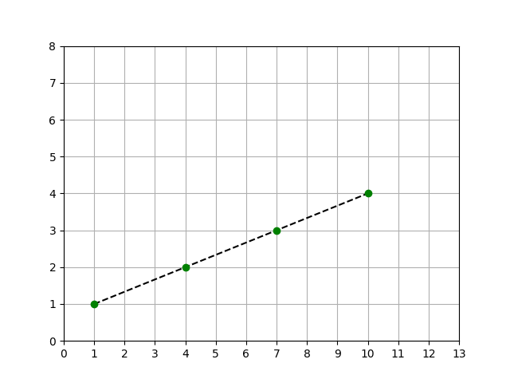
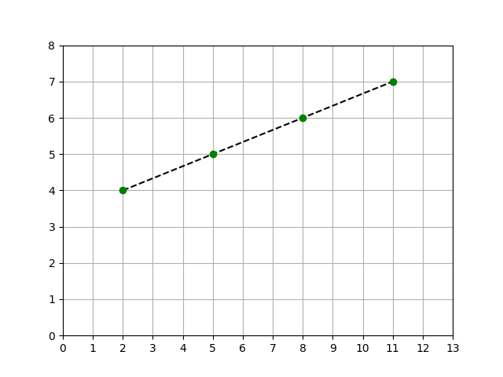
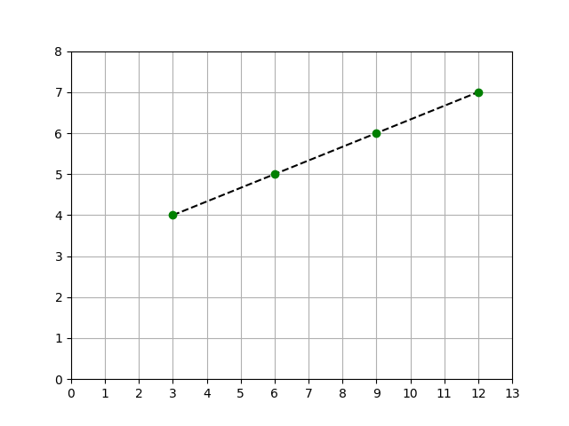

# Resolução - Lista 4 Questão 20

## Enunciado da Questão

Seja a seguinte série: 1, 4, 4, 2, 5, 5, 3, 6, 6, 4, 7, 7, (...). Faça um algoritmo que seja capaz de gerar os N termos dessa série. Esse número N deve ser lido do teclado.

## Resolução

Considerando $x$ a posição do número na sequência e $f(x)$ o valor do número, podemos construir a seguinte tabela de resultados com as informações que temos:

| $x$ | $f(x)$ |
|---|---|
| 1 | 1 |
| 2 | 4 |
| 3 | 4 |
| 4 | 2 |
| 5 | 5 |
| 6 | 5 |
| 7 | 3 |
| 8 | 6 |
| 9 | 6 |
| 10 | 4 |
| 11 | 7 |
| 12 | 7 |

É possível identificar certos padrões analisando a tabela, o mais intuitivo é começar a contagem crescente dos números naturais a partir do 1 e intercalar cada um deles somando com 3 duas vezes. Apesar de correta e possível de implementar, acabei encontrando outro método que achei mais interessante para codificar.

Analisando novamente, é possível encontrar 3 sequências no padrão:

1. Começando no primeiro número com valor 1, incrementá-lo a cada 3 termos (1º, 4º, 7º, 9º, ...)
2. Começando no segundo número com valor 4, incrementá-lo a cada 3 termos (2º, 5º, 8º, 11º, ...)
3. Começando no terceiro número com valor 4, incrementá-lo a cada 3 termos (3º, 6º, 9º, 12º, ...)

Em todos os casos, podemos traçar uma reta no plano cartesiano com base na relação entre a posição
do número $x$ e o valor do mesmo $f(x)$:

- 1º Caso

- 2º Caso

- 3º Caso

Com base nos desenhos dos gráficos, todos os casos possuem características de uma [Função Afim ou Função do Primeiro Grau](https://www.todamateria.com.br/funcao-afim/) (o link anexado não possui quaisquer fins comerciais ou publicitários). Dessa forma, é possível utilizar propriedades desse tipo de equação para construir uma equação descobrir o valor do número conforme sua posição.

### 1º Caso

Tendo em vista a estrutura de uma função do primeiro grau e que no momento temos apenas informações da relação entre a incógnita e o resultado da função. Com isso, é possível descobrir o valor do coeficiente angular através da razão entre a variação de *f(x)* e a variação de *x*, arbitrariamente, será selecionado a variação entre *x=4* e *x=1*:

$$
\begin{aligned}
a &= \frac{\Delta y}{\Delta x} \\
a &= \frac{2-1}{4-1} \\
a &= \frac{1}{3}
\end{aligned}
$$

Agora com os valores atuais, é possível descobrir o coeficiente linear usando *x=1*:

$$
\begin{aligned}
f(x) &= ax+b \\
1 &= \frac{1}{3} \cdot 1 + b \\
b + \frac{1}{3} &= 1 \\
b &=1 - \frac{1}{3} \\
b &= \frac{2}{3}
\end{aligned}
$$

Portanto, a função matemática para descobrir o valor do número na sequência do enunciado, sendo *x* o número da sua posição, é:

$$f(x) = \frac{x}{3} + \frac{2}{3} \quad \text{ou} \quad f(x) = \frac{x+2}{3}$$

### 2º Caso

O método de resolução é o mesmo do usado no [1º caso](#1-caso). Começando pelo coeficiente angular:

$$
\begin{aligned}
a &= \frac{\Delta y}{\Delta x} \\
a &= \frac{5-4}{5-2} \\
a &= \frac{1}{3}
\end{aligned}
$$

Calculando seu coeficiente linear:

$$
\begin{aligned}
f(x) &= ax+b \\
4 &= \frac{1}{3} \cdot 2 + b \\
b + \frac{2}{3} &= 4 \\
b &= 4 - \frac{2}{3} \\
b &= \frac{10}{3}
\end{aligned}
$$

Portanto, a fórmula para este caso é:

$$f(x) = \frac{x}{3} + \frac{10}{3} \quad \text{ou} \quad  f(x) = \frac{x+10}{3}$$

### 3º Caso

Coeficiente angular:
$$
\begin{aligned}
a &= \frac{\Delta y}{\Delta x} \\
a &= \frac{5-4}{6-3} \\
a &= \frac{1}{3}
\end{aligned}
$$

Coeficiente linear:
$$
\begin{aligned}
f(x) &= ax+b \\
4 &= \frac{1}{3} \cdot 3 + b \\
b + 1 &= 4 \\
b &= 4 - 1 \\
b &= 3
\end{aligned}
$$

Assim, a equação para o último caso é:
$$f(x) = \frac{x}{3} + 3$$

## Conclusão

Após descobrir as equações para resolver os 3 casos presentes na sequência, apenas é preciso sintetizar a conclusão matemática. Na linguagem formal matemática, não existe algum operador ou estrutura para representar diretamente algo como "a cada X intervalos", entretanto, na computação existe o operador *"mod"* para representar o resto de um cálculo da divisão, com isso, podemos usar o *mod* de 3 para conseguir especificar em qual caso, primeiro, segundo ou terceiro, o termo está incluso.

### 1º Caso

Analisando a posição dos número que se enquadram no primeiro caso: 

$$1, 4, 7, 10, ...$$

É possível identificar que segue o padrão de uma progressão aritmética de razão 3 e termo inicial igual a 1. Sendo assim:

$$
\begin{aligned}
a_1 + r(a_n-1) \\
1+3(a_n-1)
\end{aligned}
$$

Analisando essa expressão, é possível concluir que o número final sempre vai ser o sucessor de um múltiplo de 3, logo, o resultado de $x \mod 3$, sendo $x$ um termo qualquer do 1º caso, sempre vai retornar 1.

### 2º Caso

Analisando o segundo caso:

$$2, 5, 8, 11, ...$$

Também se enquadra como uma P.A. porém com termo inicial igual a 2, verificando a expressão com as incógnitas substituídas:

$$2+3(a_n-1)$$

Com isso, é possível inferir com qualquer termo deste caso, $x\mod3$ sempre é igual a 2.

### 3º Caso

Com a sequência:

$$3, 6, 9, 12, ...$$

Vemos que trata-se de uma sequência de múltiplos de 3, logo, $x\mod3$ é sempre igual a 0.

## Equação Final

A função matemática que retorna o valor do número, denominada $f(x)$ sendo $x$ a sua posição na sequência, é: 

$$
f(x) = \begin{cases}
\frac{x+2}{3}, \text{ se } x\mod3  = 1 \\
\frac{x+10}{3}, \text{ se } x\mod3 = 2 \\
\frac{x}{3} + 3, \text{ se } x\mod3 = 0
\end{cases}
$$
